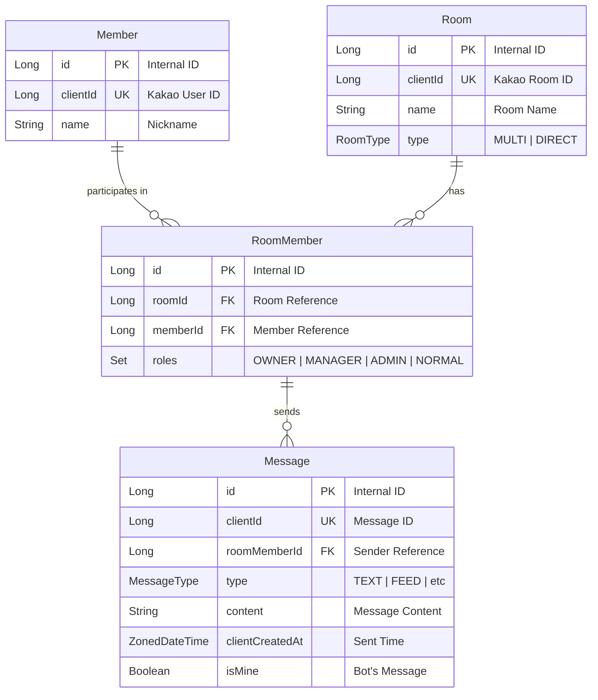

# spring-iris

spring-iris는 Python으로 작성된 [irispy-client](https://github.com/dolidolih/irispy-client) 모듈을 Spring 답게 재구현한 프로젝트 입니다.

> 개발자는 `MessageHandler.kt` 파일을 수정하여 봇의 동작을 커스터마이징할 수 있습니다.

## 주요 특징

- 🎯 **간단한 커스터마이징** - `MessageHandler.kt` 파일만 수정하면 봇 완성
- ⚡ **Kotlin Flow 아키텍처** - 명시적인 데이터 흐름과 간결한 코드
- ⚙️ **고성능 비동기 처리** - Java 21 가상 스레드(Virtual Threads) + Kotlin 코루틴으로 높은 동시성 처리
- 🔌 **WebSocket 실시간 통신** - Iris 클라이언트를 통한 연결
- 📦 **Command 패턴** - 명령어 체이닝 및 확장 가능한 구조
- 💾 **자동 DB 관리** - Room, Member, Message 자동 저장
- 🔗 **카카오링크 지원** - [irispy-client](https://github.com/dolidolih/irispy-client/blob/main/iris/kakaolink/KakaoLinkModule.py) 를 Kotlin으로 변환한 카카오링크 모듈 지원

## 빠른 시작

### 사전 요구사항

- Java 21+
- Docker & Docker Compose (PostgreSQL, Redis 설치용)
- Iris Server (https://github.com/dolidolih/Iris)

### 설치

```bash
git clone https://github.com/not-robot613/spring-iris
cd spring-iris
```

### 환경 설정

프로젝트 루트에 `.env` 파일을 생성하세요:

```env
# PostgreSQL Database
POSTGRES_HOST=your_host
POSTGRES_PORT=your_port
POSTGRES_DATABASE=your_database_name
POSTGRES_USERNAME=your_username
POSTGRES_PASSWORD=your_password

# Redis
REDIS_HOST=your_host
REDIS_PORT=your_port

# Iris Client
IRIS_HOST=your_iris_host
IRIS_PORT=your_iris_port

# Bot Configuration
BOT_NAME=your_bot_name
BOT_COMMAND_PREFIX=! # 명령어 접두사 (예: /, !)
ADMIN_PASSWORD=your_secure_password # 관리자 로그인을 위한 비밀번호

# KakaoLink (선택)
KAKAOLINK_APP_KEY=your_app_key
KAKAOLINK_ORIGIN=your_origin
```

### Docker로 PostgreSQL & Redis 설치

프로젝트에 `docker-compose.yml` 파일이 포함되어 있습니다. `.env` 파일의 환경변수를 자동으로 사용합니다.

```bash
# 컨테이너 시작
docker-compose up -d

# 컨테이너 중지
docker-compose down

# 로그 확인
docker-compose logs -f
```

> 💡 `docker-compose.yml`은 `.env` 파일의 `POSTGRES_PORT`, `POSTGRES_DATABASE`, `REDIS_PORT` 등을 자동으로 사용합니다.

### 실행

```bash
./gradlew bootRun
```

## 사용법

### MessageHandler 커스터마이징 (빠른 구현)

`MessageHandler.kt`:

```kotlin
@Component
class MessageHandler(
    private val replier: ReplyClient
) {
    suspend fun handleGeneralMessage(room: RoomInfo, sender: MemberInfo, msg: MsgInfo) {
        when {
            msg.content.contains("안녕") -> {
                replier.reply(TextIrisResponse(
                    room = room.clientId,
                    data = "안녕하세요, ${sender.name}님!"
                ))
            }
        }
    }
}
```

### Command 패턴 (권장)

**Step 1: CommandType enum에 추가**

```kotlin
enum class CommandType(val command: String) {
    HELLO("안녕"),
    // ...
}
```

**Step 2: Command 구현**

```kotlin
@Component
class HelloCommand(private val replier: ReplyClient) : Command {
    override val commandType = CommandType.HELLO
    
    override fun matches(msg: MsgInfo) = msg.content == commandType.command
    
    override suspend fun execute(msg: MsgInfo, room: RoomInfo, sender: MemberInfo): CommandResult {
        replier.reply(TextIrisResponse(
            room = room.clientId,
            data = "안녕하세요!"
        ))
        return CommandResult(quit = true)
    }
    
    override fun getDescription(msg: MsgInfo, room: RoomInfo, sender: MemberInfo) = "인사 명령어"
}
```

**Step 3: CommandRegistry에 등록**

```kotlin
@Component
class CommandRegistry(
    private val botConfig: BotConfig,
    private val helloCommand: HelloCommand  // 생성자 주입
) {
    private val commands: List<Command> = listOf(
        helloCommand
    )
    // ...
}
```

> 💡 Spring의 의존성 주입을 사용하므로 `@Component`로 등록된 Command는 생성자에서 주입받습니다.

## API Reference

### MessageHandler

메시지 이벤트를 처리하는 핸들러입니다. 모든 메서드는 동일한 시그니처를 가집니다:

```kotlin
suspend fun handle*(room: RoomInfo, sender: MemberInfo, msg: MsgInfo)
```

**메서드:**

| 메서드                       | 설명        | 트리거 조건        |
|---------------------------|-----------|---------------|
| `handleGeneralMessage`    | 일반 메시지    | 사용자 메시지 수신 시  |
| `handleNewMember`         | 새 멤버 입장   | 새 멤버가 채팅방에 입장 |
| `handleExitMember`        | 멤버 퇴장     | 멤버가 채팅방에서 퇴장  |
| `handleOpenLink`          | 오픈링크 입장   | 오픈링크로 채팅방 입장  |
| `handleKick`              | 강제 퇴장     | 관리자가 멤버를 강퇴   |
| `handleDeleteAllMessages` | 전체 메시지 삭제 | 채팅방 메시지 전체 삭제 |

### Command

명령어 인터페이스입니다.

```kotlin
interface Command {
    val commandType: CommandType
    fun matches(msg: MsgInfo): Boolean
    suspend fun execute(msg: MsgInfo, room: RoomInfo, sender: MemberInfo): CommandResult
    fun getDescription(msg: MsgInfo, room: RoomInfo, sender: MemberInfo): String
}
```

**CommandResult:**

```kotlin
data class CommandResult(
    val quit: Boolean  // true: 명령어 체인 중단, false: 다음 명령어 계속 실행
)
```

> 💡 **명령어 체이닝**: `quit = false`를 반환하면 다음 매칭되는 명령어도 계속 실행됩니다.

### DTO Classes

#### RoomInfo

```kotlin
data class RoomInfo(
    val internalId: Long,  // 내부 DB ID
    val clientId: Long,    // 클라이언트 방 ID ⭐ (응답 전송 시 필수!)
    val name: String,      // 방 이름
    val type: RoomType,    // OPEN_CHAT, DIRECT, etc.
    val url: String?       // 방 URL (옵션)
)
```

> ⚠️ **중요**: `replier.reply()` 호출 시 **반드시 `room.clientId`를 사용**해야 합니다!

#### MemberInfo

```kotlin
data class MemberInfo(
    val clientId: Long,    // 클라이언트 사용자 ID
    val name: String,      // 사용자 이름
    val roles: Set<Role>   // 권한 집합
)
```

**Role enum:**

채팅방 내 사용자의 권한을 나타냅니다.

```kotlin
enum class Role(val value: Int, val stringName: String, val level: Int) {
    HOST(1, "방장", 10),           // 방장
    MANAGER(4, "부방장", 5),        // 관리자/부방장
    NORMAL(2, "일반 유저", 1),      // 일반 사용자
    ADMIN(6, "봇 관리자", 100),     // 봇 관리자 (최고 권한)
    BOT(8, "봇", 1),               // 봇
    UNKNOWN(0, "알 수 없음", 1),    // 알 수 없음
    REAL_PROFILE(-1, "실제 프로필", 1)  // 실제 프로필
}
```

**권한 레벨:**
- `ADMIN` (100) - 봇 관리자 (최고 권한)
- `HOST` (10) - 방장
- `MANAGER` (5) - 부방장
- `NORMAL` (1) - 일반 사용자

**사용 예:**

```kotlin
// 방 관리자 권한 확인 (방장 또는 부방장)
val isRoomAdmin = sender.roles.contains(Role.HOST) || sender.roles.contains(Role.MANAGER)

// 봇 관리자 확인
val isBotAdmin = sender.roles.contains(Role.ADMIN)

// 레벨 기반 권한 확인
val hasHighPermission = sender.roles.any { it.level >= 5 }
```

#### MsgInfo

```kotlin
data class MsgInfo(
    val id: Long,              // 메시지 ID
    val type: MessageType,     // 메시지 타입
    var content: String,       // 메시지 내용
    val createdAt: ZonedDateTime,  // 생성 시각
    val isMine: Boolean,       // 봇이 보낸 메시지인지 여부
    val referenceId: Long?     // 답장 대상 메시지 ID
)
```

### ReplyClient

메시지를 전송하는 클라이언트입니다.

```kotlin
class ReplyClient {
    suspend fun reply(irisResponse: IrisResponse): Result<Unit>
}
```

**IrisResponse 타입:**

```kotlin
sealed interface IrisResponse {
    val room: Long  // ⚠️ RoomInfo.clientId 값 사용!
}

// 텍스트 메시지
data class TextIrisResponse(
    override val room: Long,
    val data: String
) : IrisResponse

// 이미지 (단일)
data class ImageIrisResponse(
    override val room: Long,
    val data: String  // Base64 인코딩
) : IrisResponse

// 이미지 (다중)
data class ImageMultipleIrisResponse(
    override val room: Long,
    val data: List<String>
) : IrisResponse
```

```kotlin
replier.reply(TextIrisResponse(
    room = room.clientId,
    data = "Hello!"
))
```

### KakaoLink

카카오링크 메시지를 전송하기 위한 클래스입니다.

```kotlin
@Component
class KakaoLink {
    suspend fun send(
        receiverName: String,
        templateId: Int,
        templateArgs: Map<String, Any>
    )
}
```

**파라미터:**
- `receiverName`: 수신자 채팅방 이름
- `templateId`: 카카오 디벨로퍼에서 생성한 템플릿 ID
- `templateArgs`: 템플릿에 전달할 변수 맵

**사용 예:**

```kotlin
@Component
class CustomLinkCommand(
    private val kakaoLink: KakaoLink
) : Command {
    override suspend fun execute(msg: MsgInfo, room: RoomInfo, sender: MemberInfo): CommandResult {
        kakaoLink.send(
            receiverName = room.name,
            templateId = 12345,
            templateArgs = mapOf(
                "title" to "알림",
                "description" to "새로운 메시지가 도착했습니다"
            )
        )
        return CommandResult(quit = true)
    }
}
```

> 💡 **설정**: `KAKAOLINK_APP_KEY`와 `KAKAOLINK_ORIGIN` 환경변수가 필요합니다. 설정하지 않으면 기본값 "none"이 사용됩니다.

## 고급 예제

### 파라미터 명령어

```kotlin
@Component
class EchoCommand(private val replier: ReplyClient) : Command {
    override val commandType = CommandType.ECHO
    override fun matches(msg: MsgInfo) = msg.content.startsWith(commandType.command)
    
    override suspend fun execute(msg: MsgInfo, room: RoomInfo, sender: MemberInfo): CommandResult {
        val text = msg.content.removePrefix(commandType.command).trim()
        replier.reply(TextIrisResponse(
            room = room.clientId,
            data = text.ifEmpty { "메시지를 입력하세요!" }
        ))
        return CommandResult(quit = true)
    }
    
    override fun getDescription(msg: MsgInfo, room: RoomInfo, sender: MemberInfo) = "메시지 반복"
}
```

### 관리자 전용 명령어

```kotlin
@Component
class AdminCommand(private val replier: ReplyClient) : Command {
    override val commandType = CommandType.ADMIN
    override fun matches(msg: MsgInfo) = msg.content == commandType.command
    
    override suspend fun execute(msg: MsgInfo, room: RoomInfo, sender: MemberInfo): CommandResult {
        if (!sender.roles.contains(Role.MANAGER) && !sender.roles.contains(Role.OWNER)) {
            replier.reply(TextIrisResponse(
                room = room.clientId,
                data = "⚠️ 관리자만 사용할 수 있습니다."
            ))
            return CommandResult(quit = true)
        }
        
        // 관리 로직...
        replier.reply(TextIrisResponse(
            room = room.clientId,
            data = "✅ 관리 작업 완료"
        ))
        return CommandResult(quit = true)
    }
    
    override fun getDescription(msg: MsgInfo, room: RoomInfo, sender: MemberInfo) = "관리자 전용"
}
```

### 봇 관리자 승격 (내장 기능)

프로젝트에는 닉네임 기반 관리자 승격 기능이 내장되어 있습니다.

**명령어**: `관리자로그인 [비밀번호] [닉네임]`

**동작**:
- 비밀번호가 `ADMIN_PASSWORD` 환경변수와 일치하면, 해당 닉네임이 포함된 **모든 방의 멤버**를 `Role.ADMIN`으로 승격
- 승격된 멤버 수를 응답으로 반환

**예시**:
```
# 카카오톡에서 입력
관리자로그인 mypassword 홍길동
# 응답
✅ '홍길동' 닉네임을 가진 모든 멤버 3명이 봇 관리자로 승격되었습니다!
```

> 💡 `.env`에 `ADMIN_PASSWORD=your_secure_password` 설정 필요

### 외부 API 호출

```kotlin
@Component
class WeatherApiCommand(
    private val replier: ReplyClient,
    private val restTemplate: RestTemplate
) : Command {
    override val commandType = CommandType.WEATHER
    override fun matches(msg: MsgInfo) = msg.content.startsWith(commandType.command)
    
    override suspend fun execute(msg: MsgInfo, room: RoomInfo, sender: MemberInfo): CommandResult {
        val city = msg.content.removePrefix(commandType.command).trim()
        val weather = withContext(Dispatchers.IO) {
            restTemplate.getForObject(
                "https://api.weather.com/v1/weather?city=$city",
                WeatherResponse::class.java
            )
        }
        
        replier.reply(TextIrisResponse(
            room = room.clientId,
            data = "🌤 ${city}의 날씨: ${weather?.description ?: "정보 없음"}"
        ))
        return CommandResult(quit = true)
    }
    
    override fun getDescription(msg: MsgInfo, room: RoomInfo, sender: MemberInfo) = "날씨 정보"
}
```

### 데이터베이스 사용 (Service 레이어)

**Step 1: MemberService에 메서드 추가**

`MemberService.kt`:

```kotlin
@Service
class MemberService(private val repository: MemberRepository) {
    // 기존 메서드들...
    
    @Transactional(readOnly = true)
    fun findByClientId(clientId: Long): Member {
        return repository.findByClientId(clientId)
    }
}
```

**Step 2: Command에서 사용**

```kotlin
@Component
class UserInfoCommand(
    private val replier: ReplyClient,
    private val memberService: MemberService
) : Command {
    override val commandType = CommandType.USER_INFO
    override fun matches(msg: MsgInfo) = msg.content == commandType.command

    override suspend fun execute(msg: MsgInfo, room: RoomInfo, sender: MemberInfo): CommandResult {
        val member = withContext(Dispatchers.IO) {
            memberService.findByClientId(sender.clientId)
        }

        val info = """
            👤 ${sender.name}님의 정보
            - Client ID: ${member.clientId}
            - DB ID: ${member.id}
        """.trimIndent()

        replier.reply(TextIrisResponse(
            room = room.clientId,
            data = info
        ))
        return CommandResult(quit = true)
    }

    override fun getDescription(msg: MsgInfo, room: RoomInfo, sender: MemberInfo) = "사용자 정보 (DB 조회)"
}
```

> 💡 **확장 패턴**: 필요한 메서드를 Service에 추가하여 사용하세요. Repository를 직접 사용하지 않고 **Service 레이어**를 통해 접근합니다.

## Database Schema

### ERD



### Entity Reference

#### Member
- `id`: 데이터베이스 내부 식별자 (Long, PK)
- `clientId`: 카카오톡 사용자 고유 식별자 (Long, UK)
- `name`: 사용자 닉네임 (String)

#### Room
- `id`: 데이터베이스 내부 식별자 (Long, PK)
- `clientId`: 카카오톡 채팅방 고유 식별자 (Long, UK)
- `name`: 채팅방 이름 (String)
- `type`: 채팅방 타입 (RoomType - MULTI: 단체톡, DIRECT: 1:1톡)

#### RoomMember
- `id`: 데이터베이스 내부 식별자 (Long, PK)
- `room`: 소속된 채팅방 (Room, FK)
- `member`: 속해있는 사용자 (Member, FK)
- `roles`: 해당 채팅방에서의 권한 세트 (Set<Role> - OWNER: 방장, MANAGER: 부방장, ADMIN: 봇 관리자, NORMAL: 일반 사용자)

#### Message
- `id`: 데이터베이스 내부 식별자 (Long, PK)
- `clientId`: 메시지 고유 식별자 (Long, UK)
- `roomMember`: 메시지를 보낸 사용자 정보 (RoomMember, FK)
- `type`: 메시지 종류 (MessageType)
- `content`: 메시지 내용 (String, TEXT)
- `clientCreatedAt`: 클라이언트 측 메시지 생성 시간 (ZonedDateTime)
- `isMine`: 봇이 보낸 메시지 여부 (Boolean)
- `referenceClientId`: 답장 메시지인 경우 참조 대상의 clientId (Long, Nullable)

> 💡 모든 엔티티는 `BaseEntity`를 상속받아 `createdAt` (생성일시), `updatedAt` (수정일시) 필드를 공통으로 가집니다.

## 프로젝트 구조

```
src/main/kotlin/spring/iris/
├── bot/                          # 🎯 개발자 커스터마이징 영역
│   ├── command/                  # 명령어
│   │   ├── CommandRegistry.kt
│   │   ├── constant/CommandType.kt
│   │   ├── dto/CommandResult.kt
│   │   ├── impl/                 # 명령어 구현체
│   │   └── interfaces/Command.kt
│   └── message/
│       ├── handler/MessageHandler.kt  # ⭐ 주요 커스터마이징 파일
│       └── dto/                   # RoomInfo, MemberInfo, MsgInfo
│
└── infra/                         # ❌ 프레임워크 코드 (수정 불필요)
    ├── iris/                      # Iris 클라이언트 통신
    │   ├── reply/ReplyClient.kt
    │   └── websocket/WebSocketService.kt
    ├── message/
    │   ├── processor/MessageProcessor.kt
    │   └── service/MessageProcessingService.kt
    └── db/                        # Database
        ├── member/MemberService.kt
        ├── room/RoomService.kt
        └── message/MessageService.kt
```

## 아키텍처

### Flow 기반 메시지 처리

```
카카오톡 메시지
    ↓
WebSocket (Iris)
    ↓
WebSocketService → SharedFlow.emit()
    ↓
MessageProcessor → Flow.collect()
    ↓
MessageProcessingService → DB 저장
    ↓
MessageHandler ← 🎯 개발자 커스터마이징 영역
    ↓
ReplyClient → 응답 전송
```

**설계 철학:**
- **프레임워크 코드와 커스터마이징 영역 명확히 분리**
- **MessageHandler만 수정 - 나머지는 자동 처리**
- **간단한 파라미터** - `room`, `sender`, `msg` 3개만 집중

## 라이선스
MIT License

## 참조
- [irispy-client](https://github.com/dolidolih/irispy-client) by @dolidolih
- [node-iris](https://github.com/SYNCATE-CORE/node-iris) by @SYNCATE-CORE